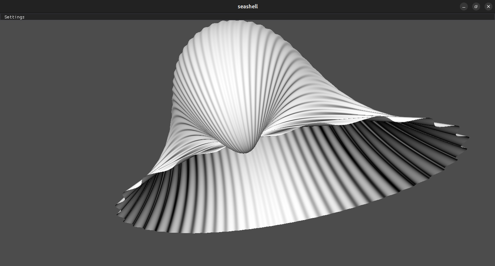
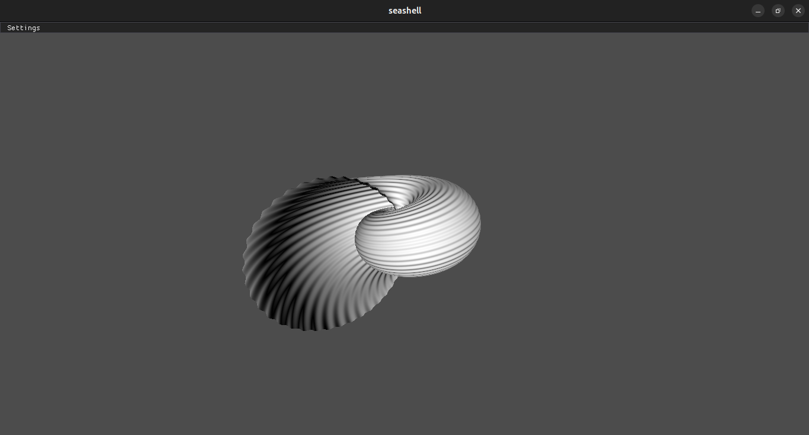
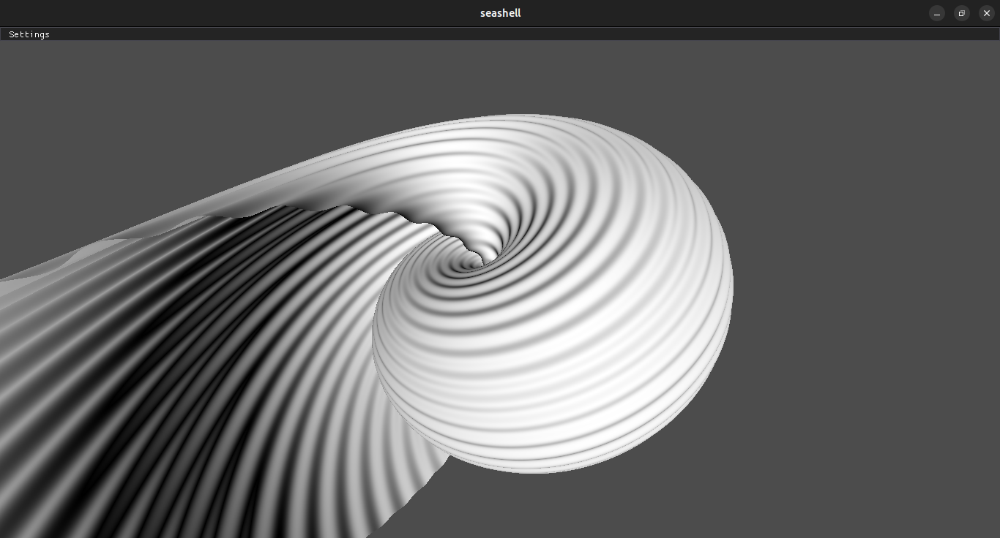
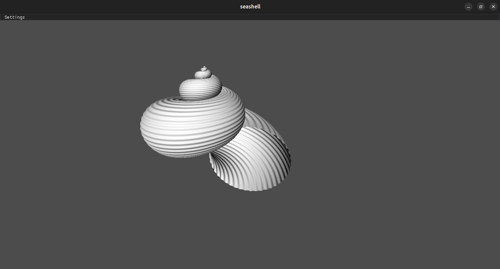
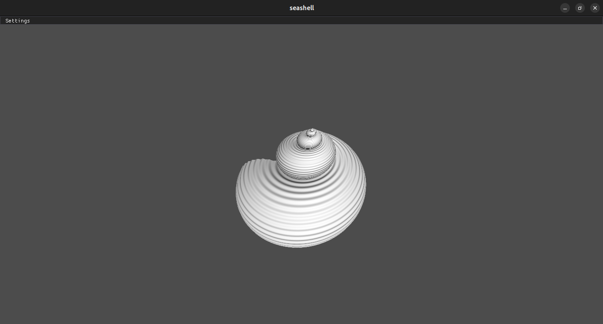
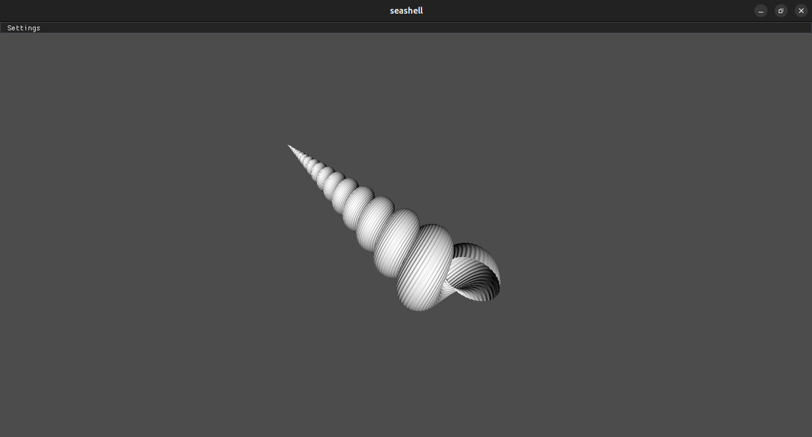
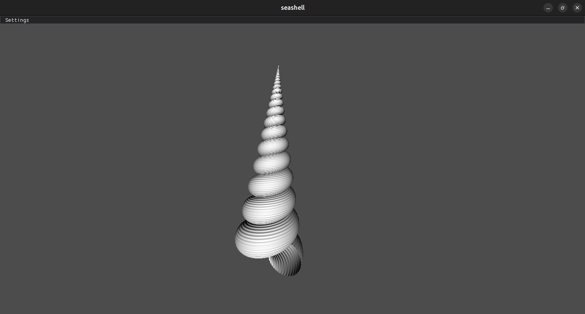

I made a parametric equation that describes a class of seashells.

# Equation:

${{\exp\left({{{{g}} {{\left({{1}{-{v}}}\right)}}} + {{{h}} {{v}}}}\right)}} {{{R_z(f \cdot v)}}} \cdot {{\left({{{{{R_x(2 \pi u)}}} \cdot {{{e_x}}} \cdot {{\left({{1} + {{{d}} {{\cos\left( {{{2}} {{π}} \cdot {{e}} {{u}}}\right)}}}}\right)}}} + {\vec{v}}}\right)}}$  

# Pictures:

