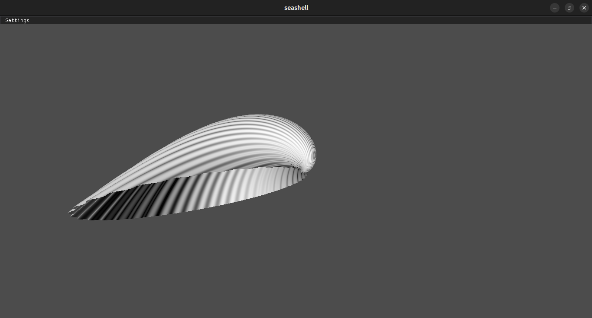

I made a parametric equation that describes a class of seashells.

# Equation:

${{\exp\left({{{{\left({{{{f}} {{\left({{1}{-{v}}}\right)}}} + {{{g}} {{v}}}}\right)}} {{I}}} + {{{{\star e_y}}} \cdot {{e}} {{v}}}}\right)}} {{\left({{{{\exp\left({{{{\star e_x}}} \cdot {{2}} {{π}} \cdot {{u}}}\right)}} {{{e_x}}} \cdot {{\left({{1} + {{{a}} {{\cos\left( {{{2}} {{π}} \cdot {{b}} {{u}}}\right)}}} + {{{c}} {{\cos\left( {{{2}} {{π}} \cdot {{d}} {{v}}}\right)}}}}\right)}}} + {\vec{v}}}\right)}}$  

# Pictures:

